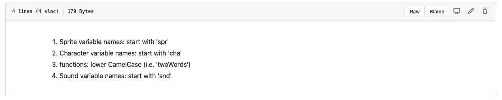

# Presentation - Week 2 -
|Team Cyan|
|-|
|Week 2|
|30.10.2020|
---
## Previous Presentation
---

## This Sprint
---

### Self organised
- github project

- bath.github repository

- Miro board 

- daily stand-up (SCRUM)

### Code Base
- Java Language choice
- decided to use libGDX
- Naming conventions and code standards

### Sotware Architecture 
- Looked into the general game architecture

	- decided on features
	- decide on menu files
- Class UML Diagrams and typings

### Game updates

## Next Sprint 

- General continue on current work 
- Carry on using Stand-ups
- all using commmon repository 
- start writing tests
- Get some menu screens
- decide on artwork style 
- decide on soundscape?

