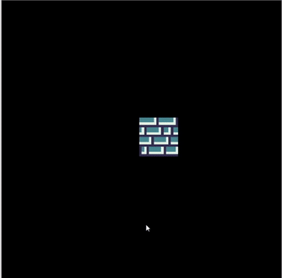

# Presentation 3

## Team Cyan

- 06 October 2020

# From previous presentation

#### State of Game

#### Planning

#### You suggested:
- MVC
	- we implemented MVC structure

# Updates

- map

- user input

- camera

- menus

- story
- sprites

- sound
- Structure 

# Future

1) Physics 

- falling 
- jumping 
- projectile
- collision 

2) Mining

- destroying blocks
- some blocks fall 
- some blocks give you items

3) Crafting

- creating items

---

(Maybe)

4) Bot - enemies

5) Bot - allie