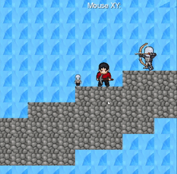
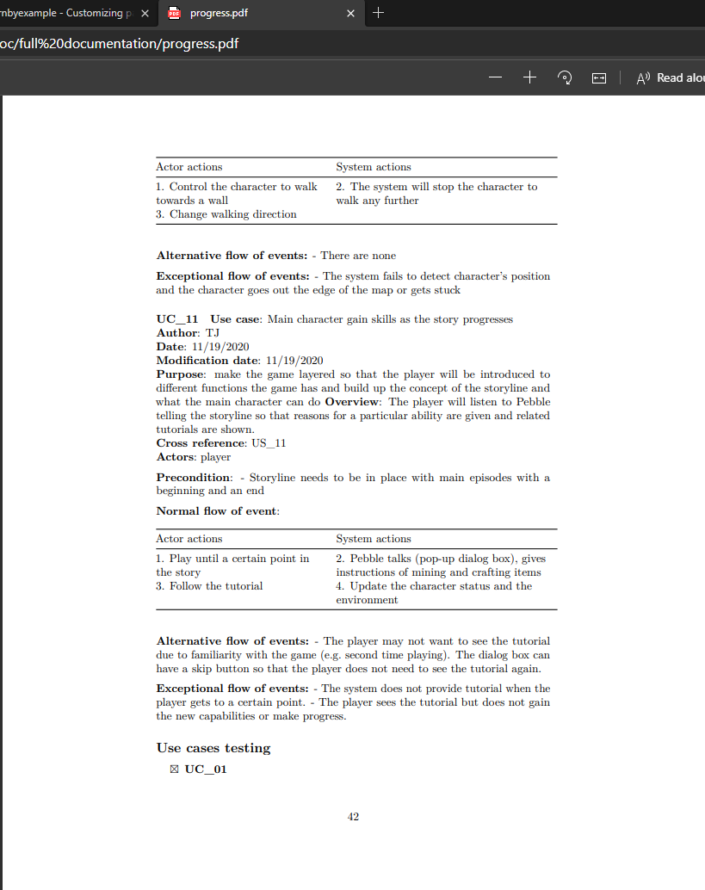

# Presentation 6

## Team Cyan
|  |          |      |
|-|-|-|
| 27   |	November	|	2020	|
# From previous presentation

- Animation added to characters

- Implemented Digging and map interaction 

  

- Countdown timer and time dependent zoom

- Implemented arrow projectiles 

- Updated Menu Screen 

# Curent Status 

# Updates

- Markdown => PDF implemented

- Inventory

- Pebble can speak and give helpful tips

- Map updates - bigger map and underground theme
- Blocks have HP and properties
- Can dig directionally and place block left/right

- Reverse gravity is working 

- Projectiles decrease health 

- Jumping works correctly 

- Difficulty selection

# Future

- Fix underlying issue
- Testing
- Final map
- Death
- Armour updates
- End Credits
