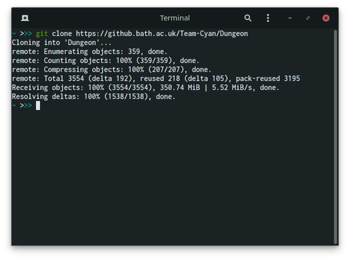
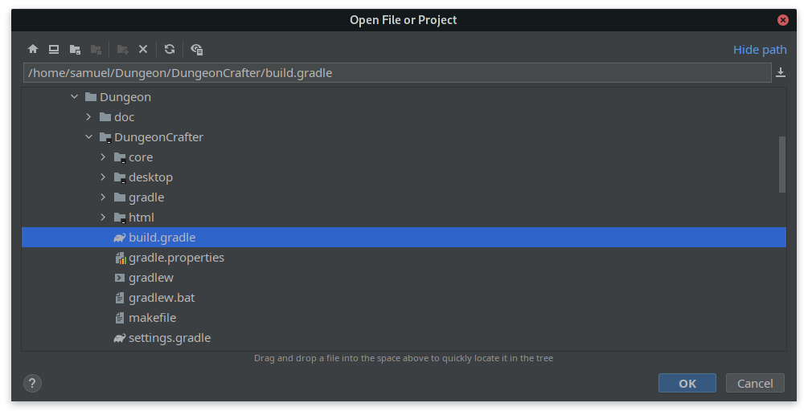
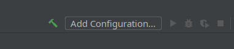
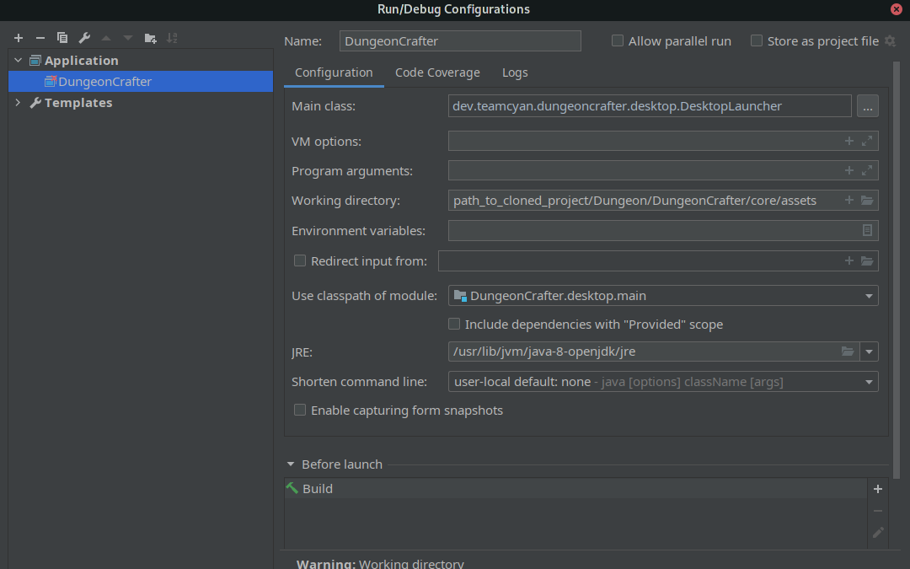
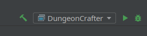

# Installation guide

This guide demonstrates how to get DungeonCrafter set up for development within the IntelliJ IDE. The guide explains the prerequisites required along with how to configure IntelliJ to run the LibGDX project.

## **Installing JRE8:**

In order to compile the code, JRE 8 is required, this can be downloaded from the link [here](https://www.oracle.com/java/technologies/javase-jre8-downloads.html)

\bcenter

{ width=50% }

\ecenter

## **Installing GIT:**

In order to copy the code to your personal machine, GIT is required, GIT can be downloaded from the link 
[here](https://git-scm.com/downloads), alternatively you may install it using your preferred package manager on Linux.

\bcenter

{ width=50% }

\ecenter

To copy the project files from the GIT repository to your local machine run 'git clone' followed by the project directory (https://github.bath.ac.uk/Team-Cyan/Dungeon) which can be accessed [here](https://github.bath.ac.uk/Team-Cyan/Dungeon). This will create a folder named 'Dungeon' with all project files inside.

\bcenter

\ecenter

## **Installing IntelliJ:**

The IntelliJ IDE can be downloaded from the link provided
[here](https://www.jetbrains.com/idea/download/)

\bcenter

{ width=50% }

\ecenter

## **Configuring IntelliJ:**

Select open file or project within IntelliJ and navigate to the file 'build.gradle' within the folder DungeonCrafter.

\bcenter

\ecenter

Once the project has opened navigate to and open the 'DesktopLauncher' file within 'desktop/src ...'

\bcenter

\ecenter

Once the file is open within IntelliJ, a run configuration need to be created to instruct IntelliJ on how to run the project. Select the 'Add Configuration' box to add a new configuration.

\bcenter

\ecenter

Select DesktopLauncher as the main class from the drop down list.

The working directory needs to be set to the 'assets' folder within the DungeonCrafter folder.

Select 'DungeonCrafter.desktop.main' from the 'use classpath of module' dropdown menu.

Select the installation location of the Java Runtime Environment <b>Version 8</b>

Click 'Apply' or 'Ok' on the bottom right of the configuraton window

\bcenter

\ecenter

Once this has been completed, the add configurations button will be replaced with the configuration that has just been created. To run the code, click the green triangle to the left of the DungeonCrafter configuration. To debug the project, select the green bug to the right of the green triangle.

\bcenter

\ecenter

