# User manual 

## Welcome to Into the Dark

You’re awoken by the echoes of crumbling rocks and dripping water. As your vision adjusts to the dim lighting your eyes trace the outline of a large underground cave with seemingly unexplored caverns scattered into the distance. The path directly in front of you is blocked by large immovable boulders, and while you have no memory of how you’ve ended up in this place you’re well aware you need to leave as soon as possible. Fortunately, your mission won’t need to be completed alone, a newfound mineral-based friend has been waiting by your side for you to emerge from your slumber. Pebble, your assistant is here to offer advice on how to navigate this foreign environment. He’s seen travellers become lost in this labyrinth before and knows humans can only stay in this area for a limited amount of time before their sanity fully debleats. Pebble is aware of the traps and pitfalls you will encounter while working your way through the cave and will provide guidance as you make your attempt to escape. Pebble has been cast aside by his rock community for being too small and now dedicates his time to help rescue humans from the rock lair as an act of defiance.

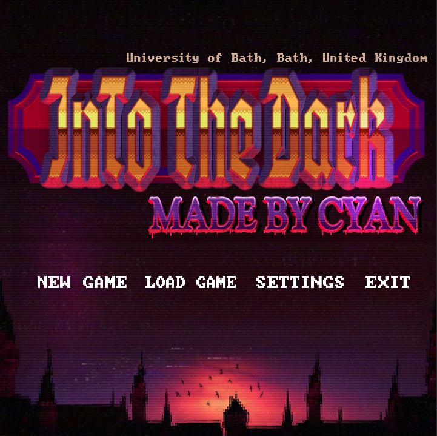

## Main menu screens:

To start a new game click on the ‘New Game’ button. You will then be taken to the difficulty selection screen. Your difficulty level will affect the amount of time you have to escape.

Easy: 1500 seconds

Medium: 750 seconds

Hard: 300 seconds

To load an existing game select the ‘Load Game’ button. This will reload the game at the point you were at before exiting to the main menu.

To view game controls select the ‘Settings’ button. This will launch a screen with all key bindings listed

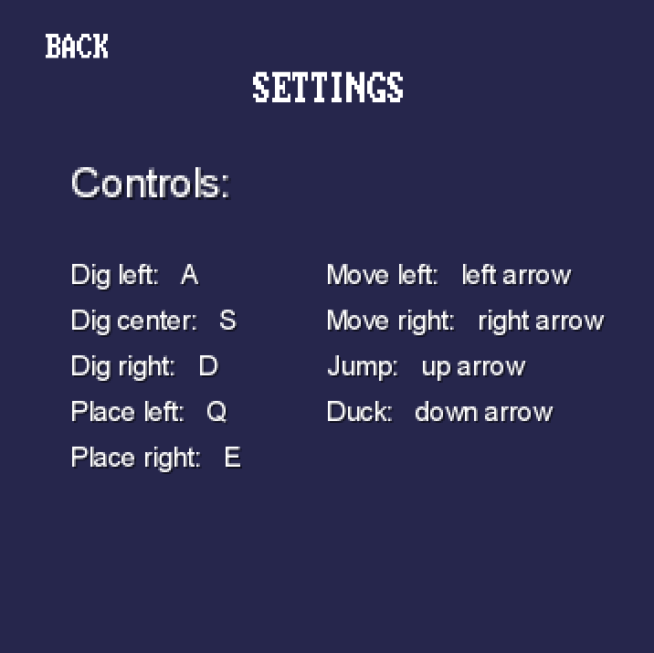

To exit the application, select the ‘Exit’ button.

## In-game menu screens:

### Inventory

Want to improve your health to fight those enemies or place with different blocks? All this can be done in the inventory. Simply click the inventory button in-game. This will take you to inventory menu where you can see the amount of each block you have as well picking which block you want to place. You will also see options to upgrade your armour and when you have enough iron or gold; 30 to be exact. Remember the more amour you have the longer you can fight enemies

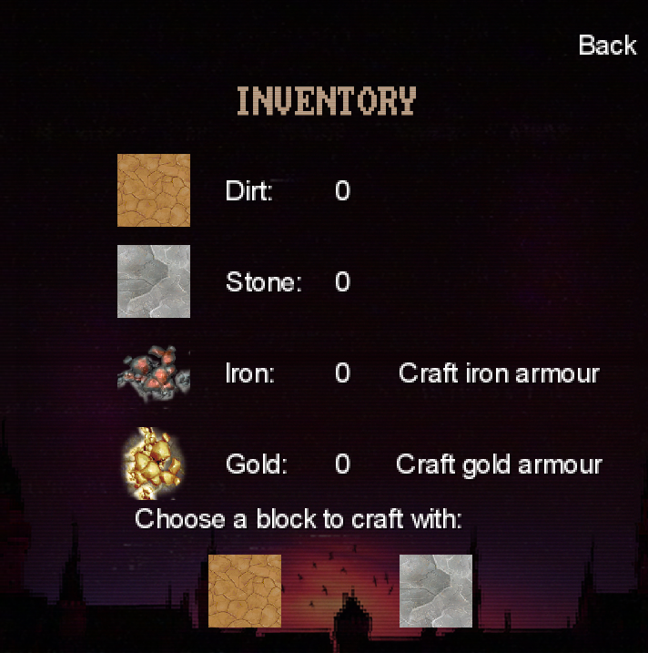

### Credits

Upon completing the game the credits screen will activate, this will provide information about the creators of the game. After the credits sequence has completed buttons will appear to allow you to either return to the main menu screen or to exit the application.

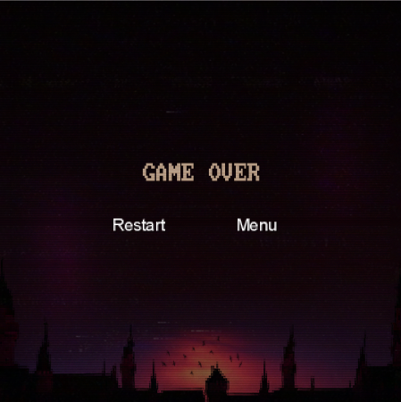

## Pebble Speech:

Throughout the game, Pebble can give you advice on how to complete the game. Listen carefully you might learn something new!

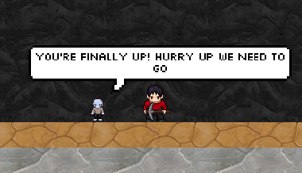

## Timer:

Be mindful of your remaining time! Once you start a new game the timer will immediately begin counting down. The colour of the timer will fade from green to red as your elapsed time increases. In addition, the zoom on the camera will increase as time elapses and your sanity decreases. This will lower your field of view and make it harder to navigate the terrain.

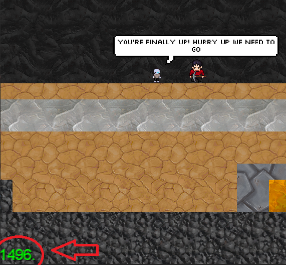

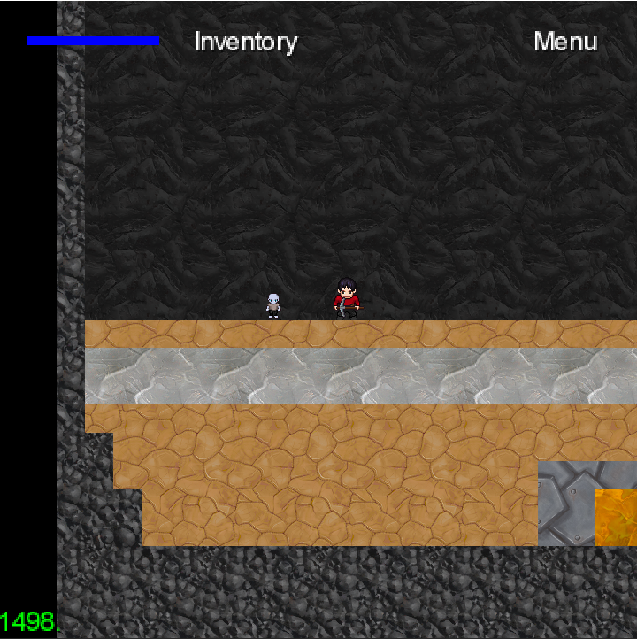

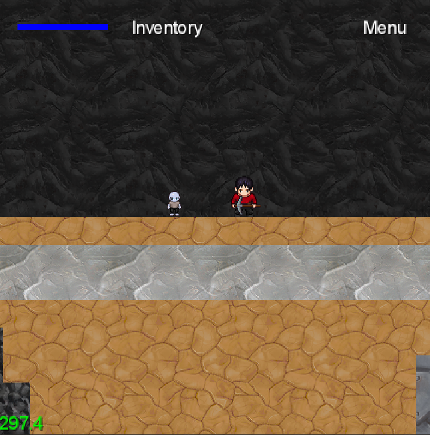

## Movement:

Movement in Into the Dark is performed using the arrow keys, hold the left or right arrow keys to move side to side, press the up arrow key to jump and hold the down arrow key to crouch.

Click [here](https://github.bath.ac.uk/Team-Cyan/Dungeon/blob/user-manual/doc/6-user-manual/gifs/walk_left.gif) to see walk left

Click [here](https://github.bath.ac.uk/Team-Cyan/Dungeon/blob/user-manual/doc/6-user-manual/gifs/walk_right.gif) to see walk right

Click [here](https://github.bath.ac.uk/Team-Cyan/Dungeon/blob/user-manual/doc/6-user-manual/gifs/duck.gif) to see crouch 

Click [here](https://github.bath.ac.uk/Team-Cyan/Dungeon/blob/user-manual/doc/6-user-manual/gifs/jump.gif) to see jump

## Mining:

Mining can be carried out in any direction to mine down press ‘S’ to mine left press ‘A’ to mine right press ‘D’ to mine up press ‘W’. The blocks below have the following properties:

- Dirt block - Health 100
- Stone block - Health 200
- Iron block - Health 300
- Gold block - Health 400
- Obsidian block – Health 500

Digging up and down will break three blocks at a time. Digging left and right will break two blocks at a time. Make sure to check the GIF to see the mining.

Click [here](https://github.bath.ac.uk/Team-Cyan/Dungeon/blob/user-manual/doc/6-user-manual/gifs/mine_left.gif) to see mining left

Click [here](https://github.bath.ac.uk/Team-Cyan/Dungeon/blob/user-manual/doc/6-user-manual/gifs/mine_right.gif) to see mining right

Click [here](https://github.bath.ac.uk/Team-Cyan/Dungeon/blob/user-manual/doc/6-user-manual/gifs/mine_up.gif) to see mining up

Click [here](https://github.bath.ac.uk/Team-Cyan/Dungeon/blob/user-manual/doc/6-user-manual/gifs/mine_down.gif) to see mining down

## Placing block:

Throughout the game, you will need to place blocks to reach areas. All you need to do is press ‘Q’ to place a block to the left or ‘E’ to place right. From here it up to you to imagine how you can place the blocks together. Remember, you can always change the block by going to the inventory screen. Make sure to check the GIF to see placing.

Click [here](https://github.bath.ac.uk/Team-Cyan/Dungeon/blob/user-manual/doc/6-user-manual/gifs/place_left.gif) to see place left

Click [here](https://github.bath.ac.uk/Team-Cyan/Dungeon/blob/user-manual/doc/6-user-manual/gifs/place_right.gif) to see place right

## Upgrading armour:

Taking a few arrows will hurt so to improve your health you can upgrade your armour. Mine both iron and gold within the game and when you have 30 you will be able to upgrade that specific armour set in the inventory screen. The option to craft the armour will light up when you have enough.

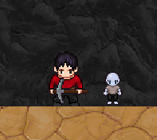

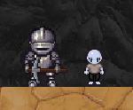

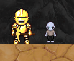

## Archers:

The rock people have archers throughout the dungeon so lookout. These will track and shoot arrows at you and if you are close, they will chase you. So, it is up to you what you do: run away, fight, or build around them. Make sure to look at the GIF to see the full shooting animation.

****

Click [here](https://github.bath.ac.uk/Team-Cyan/Dungeon/blob/user-manual/doc/6-user-manual/gifs/enemy_shoot.gif) to see archer shooting

## Attack

To battle the enemies throughout the map you will attack them with your pickaxe, which is done by holding down the spacebar. Make sure you are close enough to hit them and you will see their health go down until they die. 

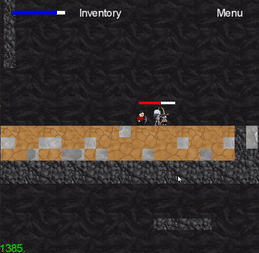

Click [here](https://github.bath.ac.uk/Team-Cyan/Dungeon/blob/user-manual/doc/6-user-manual/gifs/attack_enemy.gif) to see the attack animation

## Anti-gravity block:

You will notice a light grey coloured block in various place within the map. These are anti-gravity blocks and when you walk over them the gravity reverses, shooting you up the map. Once you exit the block the gravity returns to normal. Make sure you do not lose pebble flying about!

Click [here](https://github.bath.ac.uk/Team-Cyan/Dungeon/blob/user-manual/doc/6-user-manual/gifs/anti_grav.gif) to see anti-gravity animation

## Boss:

Located in the dungeon there will be room where the king of all the rock people resides. Here you will fight him to win the game. He will follow you and swing his battle hammer to kill you, so be creative with how you fight. Once you have killed the king the game is complete.

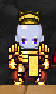

## Death:

If you are unlucky enough to lose all your health to arrows or the battle hammer, you will die, and the game run will end. The credits will pop up and at the end you will have an option to go back to the main menu so you can play again or close the program. We know which choice is better. Check the GIF to see the death animation.

Click [here](https://github.bath.ac.uk/Team-Cyan/Dungeon/blob/user-manual/doc/6-user-manual/gifs/death.gif) to see the death animation 
