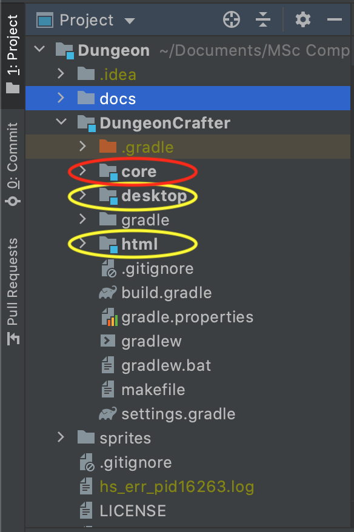

# Maintenance Guide

Into the dark is a Java programme based on the libGDX framework.

## <a name="prerequisites">Prerequisites</a>

- Java Development Kit 8+ (Must be JDK)
- libGDX

The only direct prerequisite needed to contribute to the game is libGDX. 
All the indirect prerequisites needed to setup libGDX (including JDK) and extensive setup guides for several IDEs can be found [here](https://libgdx.badlogicgames.com/documentation/gettingstarted/Setting%20Up.html). We highly recommend following libGDX's setup guides before moving on. 

## Getting the sources

Follow your preferred cloning process of a git repository. This is the link to the git:

`https://github.bath.ac.uk/Team-Cyan/Dungeon.git`

## Project organization

Make sure to satisfy all the [prerequisites](#prerequisites) before moving on.

Javadoc can be found [here](https://github.bath.ac.uk/pages/Team-Cyan/Dungeon/).

### Introduction

libGDX comes with a predefined structure optimized for multiplatform development.
In this project this structure is represented inside the [DungeonCrafter](../../DungeonCrafter) directory.
Two kinds of subdirectories exist: platform-specific directories (highlighted yellow in the directory screenshot) and a logic directory (highlighted red in the directory screenshot).
Platform-specific directories only consist of code specific to the according platform, while the logic directory holds all the project's actual platform independent logic.
The platform-specific code accesses the logical code and makes it accessible to the respective platform. 
For more information on platform-specific setups in libGDX, refer to [libGDX](https://libgdx.badlogicgames.com/documentation/gettingstarted/Creating%20Projects.html#structure-of-libgdx-projects).

### Platform support

Into the Dark is currently setup to only work on Desktop. 
You find all the desktop-specific code in [DungeonCrafter/desktop](../../DungeonCrafter/desktop).
If you want to extend the game to work in a browser or on iOS or android, please refer to libGDX's [guides](https://libgdx.badlogicgames.com/documentation/gettingstarted/Creating%20Projects.html#structure-of-libgdx-projects).

### Game Logic - MVC

The game logic is found in the [DungeonCrafter/core](../../DungeonCrafter/core/src/dev/teamcyan/dungeoncrafter) directory.
The game is structured by the Model-View-Controller pattern (MVC) according to [this](https://otter.tech/an-mvc-guide-for-libgdx/) libGDX's specific MVC-guide.
The controller logic of the game is found in the [DungeonCrafter](../../DungeonCrafter/core/src/dev/teamcyan/dungeoncrafter/DungeonCrafter.java) file.
The view logic of the game is spread over several classes in the [screens](../../DungeonCrafter/core/src/dev/teamcyan/dungeoncrafter/screens) directory.
The model logic of the game is spread over several classes in the [classes](../../DungeonCrafter/core/src/dev/teamcyan/dungeoncrafter/classes) directory.

- /core(/src/devteamcyan/dungeoncrafter)
    - /classes (MODEL)
        - GameModel.java
        - GMap.java
        - GEPlayer.java
        - ...
    - /screens (VIEW)
        - BaseScreen.java
        - MainMenuScreen.java
        - MainMenuScreen.java
        - ...
    - DungeonCrafter.java (CONTROLLER)

#### Controller

The controller holds the current game model, the audioManager, KeyListener and assetManager.
Furthermore, the [controller](../../DungeonCrafter/core/src/dev/teamcyan/dungeoncrafter/DungeonCrafter.java) takes care of initializing and changing between all the game screens.
If a new game screen is setup, it needs to be initialized in the controller.

#### View
The view logic is spread over several screen classes. 
Depending on the current location in the game, a different screen is active.
There is an abstract [BaseScreen](../../DungeonCrafter/core/src/dev/teamcyan/dungeoncrafter/screens/BaseScreen.java) class,
from which all the other screens inherit from.
New screens have to inherit from BaseScreen.

##### How to add a new screen
1. Create new class inside [screens](../../DungeonCrafter/core/src/dev/teamcyan/dungeoncrafter/screens) directory.
2. Make sure the class inherits from [BaseScreen](../../DungeonCrafter/core/src/dev/teamcyan/dungeoncrafter/screens/BaseScreen.java).
3. Make sure the class overrides the following methods: (init(), draw(), keyDown(), keyUp(), keyTyped(), touchDown(), touchUp(), touchDragged(), mouseMoved(), scrolled(), pause(), resume(), hide())
4. Go to [DungeonCrafter](../../DungeonCrafter/core/src/dev/teamcyan/dungeoncrafter/DungeonCrafter.java) and initialize the new screen in the loadScreens() methods like the other screens.
5. Switch to screen by calling changeScreen(NEWSCREEN.class) on your controller instance.

#### Model
The model logic is spread over several classes, but all the information will be held by a [GameModel](../../DungeonCrafter/core/src/dev/teamcyan/dungeoncrafter/classes/GameModel.java) instance.
The map, the player, the sidekick pebble and enemies origin here. 
Therefore, if you want to add enemies to the game, change positions of any character, etc. this is the class to go to and make according changes.

##### GMap - level Map

The structure of the [GMap](../../DungeonCrafter/core/src/dev/teamcyan/dungeoncrafter/classes/GMap.java) is based on a layered approach. There is a foreground layer, a background layer. 

Note:

- Reverse gravity blocks are added to the background layer.

- The properties of each block are embedded in their respective tiles

- The tiles are not embedded into the map to keep them lightweight. Rather, they are linked at run time using libGDXs capabilities

- We recommend you use [Tiled Map Editor](https://www.mapeditor.org/) if you want to create your own levels.
  
  - probably the best way to do so would be to copy one of our maps and then modify it

You can find the GMap and some other tests and examples in [./core/assets/tile](../../Dungeoncrafter/assets/tile/)

---

#### Further Modules and extensions
##### GMap Generator

The game's [GMap](../../DungeonCrafter/core/src/dev/teamcyan/dungeoncrafter/classes/GMap.java) implementation was thought in such a manner to allow for further extension with a GMap Generator. But as all projects, we were constrained by time and resources and this has sadly remained a nice //TODO

- The current GMap implementations was thought around the ease of integration with a proceduraly generated map

- Using a lightweight wrapper to the [libGDX TiledMap](https://github.com/libgdx/libgdx/wiki/Tile-maps) this can be done  efficiently and with no high resource needs

- Research has led to a few conclusions which should be considered when implementing the map generator

  - the map generator should not be completely random, as this would not produce the wanted result

  - there should be rules which tell the generator how many blocks can be one next to another, and of what type

  - a good implementation would be to use a gradient noise generator algorithm like  [Perlin Noise](https://en.wikipedia.org/wiki/Perlin_noise)

  - a great implementation would take into account the level's difficulty.

  - due to the use of the native libGDX, the map can be generated during the run time of the program, so in theory it should be able to create an inifinte map. The format in which the map is saved is lightweight as well `.tmx`
