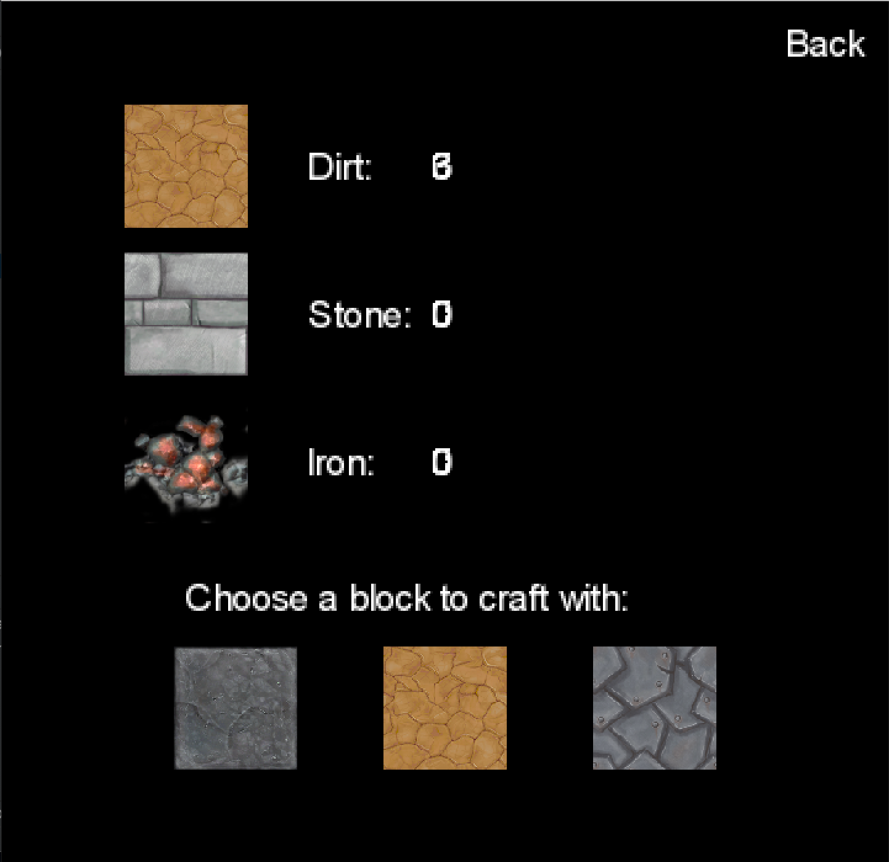

# Presentation 7

## Team Cyan
|  |          |      |
|-|-|-|
| 04  |	December	|	2020	|
# From previous presentation

- Markdown => PDF implemented

- Inventory

- Pebble can speak and give helpful tips

- Map updates - bigger map and underground theme
- Blocks have HP and properties
- Can dig directionally and place block left/right

- Reverse gravity is working 

- Projectiles decrease health 

- Jumping works correctly 

- Difficulty selection

# Curent Status 

# Updates - to be demo'ed on the actual game

- Documentation
- Improved digging
- Final map (beta version)
- Enemy Health
- Final Boss
- Inventory:
  - blocks are counting
- Sound:
  - Notification
  - Reverse Gravity
  - Ambient noises
  - Digging noises
  - Jump noise
- Speech bubble improved
- Game .jar
- Mennu Screens improved
- Fonts updated
- Player attacks
- Death animations for every character

# Future

- Java docs documentation
- Documentation part 2
- Further testing
- Video presentation
- Credits
- Bossfight triggering end game